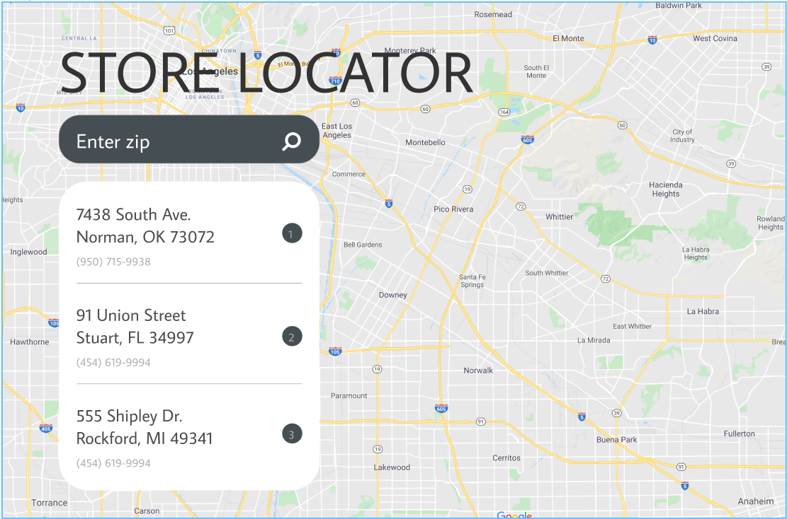

## Google Maps Challenge

[Clever Programmer](https://cleverprogrammer.teachable.com/) launched the '6-Figure JavaScript Developer Challenge' were we built a Store Locator app using the Google Maps API

## Screenshots
<p align="center">
    <h3 align="center">Design</h3>
    
</p>
<p align="center">
    <h3 align="center">Live app</h3>
    
</p>

## Tools & Languages
- HTML5
- CSS3
- Javascript
- [Fontawesome](https://fontawesome.com/) for the icons
- [Figma](https://www.figma.com/file/HuauCfrLa39DV0lK76LLZb/Google-Maps?node-id=0%3A2) UI Design & we used it as a pallette for taking colors, fonts, sizes etc...


## Usage
>You need to get an api key from the official google [documentation](https://developers.google.com/maps/documentation/javascript/get-api-key)
>
Replace googleMapsAPIKey with your key in ```index.html```
```html
<!-- You must replace 'googleMapsAPIKey' with a valid Google Maps API key in order to properly execute -->
<script async defer        
  src="https://maps.googleapis.com/maps/api/js?key=googleMapsAPIKey&callback=initMap">
</script>
```

## Contributing
Pull requests are welcome, feel free to ```fork``` this repo.

## License
This project is open sourced under the [MIT](https://opensource.org/licenses/MIT) license.
